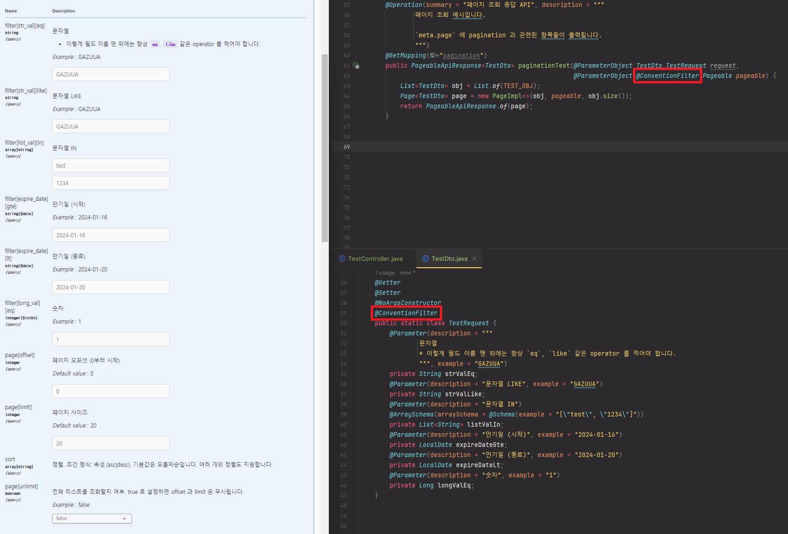

# spring-convention

사내에서 컨벤션 적용을 위해 제작했던 Spring 용 라이브러리 샘플입니다.

* demo - 시연용
* spring-convention - spring boot 2 버전용
* spring-convention-jakarta - spring boot 3 버전용
* core - 컨벤션에 필요한 공통 클래스 연관

# 사용법

해당 라이브러리를 clone 하여 `demo` 모듈에서 직접 시험해볼 수 있습니다.

애플리케이션을 실행한 후, http://localhost/swagger-ui/index.html 으로 접근하여 테스트를 해볼 수 있습니다.

`application.properties`(또는 `application.yml`) 파일을 수정합니다.

```properties
# 특수문자 허용. 반드시 추가
server.tomcat.relaxed-query-chars="[,]"
```

아래는 지원하는 property 목록이며 활성화하거나 비활성화가 가능합니다.

```properties
# QueryString filter 형식, snake_case 파라미터 지원 적용
convention.rest.enabled=true
# Swagger 변환 지원 적용
convention.swagger.enabled=true
```

### `GroupedOpenApi` 를 사용하고 있을 경우

어느 애플리케이션에서는 `GroupedOpenApi` 를 Bean 으로 등록하여 API를 그룹별로 관리하고 있을 수 있습니다. 이 경우에 `Pageable` 관련 파라미터가 Swagger 문서에 자동으로 컨벤션 형식에 맞게 적용이 되지 않을 수 있습니다. 그럴 경우에는 아래처럼 수동으로 `.addOperationCustomizer()` 를 추가하여 직접 지정해주어야 합니다.

```java
@Bean
public GroupedOpenApi someApi(SpringDataWebProperties webProperties) {
    return GroupedOpenApi.builder()
            .group("Api")
            .pathsToMatch("/v1/**")
            // 아래 추가
            .addOperationCustomizer(new SwaggerCustomizer.SwaggerOperationCustomizer(webProperties))
            .build();
}
```

> 특수문자가 들어간 경우 Escape 처리하여 실행하면 됩니다.

# 특징

## 응답 포맷 지원

주로 사용될 만한 3가지 형식의 기본 클래스를 사용할 수 있습니다.

* `EntryApiResponse` - 단일 데이터 응답
* `CollectApiResponse` - 복수 데이터 응답
* `PageableApiResponse` - 페이징 복수 데이터 응답

아래 2개의 인터페이스를 지원합니다.

* `ApiResponse`
* `AdditionalApiResponse`

```java
@GetMapping
@ResponseStatus(HttpStatus.OK)
public EntryApiResponse<SomeResult> findItem(Long id) {
    EntryApiResponse result = useCase.find(id);
    return EntryApiResponse.of(result);
}
```

```java
@GetMapping
@ResponseStatus(HttpStatus.OK)
public CollectApiResponse<SomeResult> findItems(SomeRequest request) {
    List<SomeResult> results = useCase.find(request);
    return CollectApiResponse.of(results);
}
```

```java
@GetMapping
@ResponseStatus(HttpStatus.OK)
public PageableApiResponse<SomeResult> findItems(SomeRequest request,
                                                 Pageable pageable) {
    Page<SomeResult> results = useCase.find(request, pageable);
    return PageableApiResponse.of(results);
}
```

## 오류 포맷 지원

주로 사용될 만한 2가지 형식의 기본 클래스를 사용할 수 있습니다.

* `MandatoryErrorApiResponse` - 오류 코드, 메시지만 제공
* `DetailErrorApiResponse` - 오류 코드, 메시지, 상세 제공

아래 1개의 인터페이스를 지원합니다.

* `ErrorApiResponse`

## filter 형식 지원

* `filter[domain]=google.com`
* `filter[user_id][like]=leejy`
* `page[offset]=2`
* `page[limit]=5`
* `sort[some_field]=asc`
* `sort[0][some_field]=asc`

`http://localhost?filter[domain]=google.com&filter[user_id][like]=leejy&page[offset]=2&page[limit]=5`

위와 같은 QueryString filter 형식을 지원합니다.

## Swagger `@ParameterObject` filter 형식 지원

Controller 단에서 `@ModelAttribute` 로 사용되는 클래스가 있다면 Swagger 에서 제공하는 `@ParameterObject` 를 통해 Swagger 문서를 간편하게 작성할 수 있습니다.

Swagger 문서 작성 시 `@ConventionFilter`를 붙여서 filter 형식으로 작성할 수 있습니다.

* 요청 클래스 상단에 `@ConventionFilter` 를 붙여야 합니다.
  * **반드시** 필드 이름 맨 뒤에는 Operator 를 CamelCase 로 붙여야 합니다. 예를 들어, `userId` 에 `like` Operator 를 적용하고 싶을 경우, `userIdLike` 라고 붙여야 합니다.
  * 예시
    * `userIdEq` -> `filter[user_id][eq]`
    * `userIdLike` -> `filter[user_id][like]`
    * `userIdIn` -> `filter[user_id][in]`

```java
@Getter
@Setter
@ConventionFilter
public class SomeRequest {
    @Parameter(description = "유저 아이디")
    private String userIdEq;
    @Parameter(description = "유저 아이디 (LIKE)")
    private String userIdLike;
    @Parameter(description = "만기일 (Start)")
    private LocalDate expireDateGte;
    @Parameter(description = "만기일 (End)")
    private LocalDate expireDateLt;
    @Parameter(description = "주문번호")
    private String orderNumEq;
}
```

* `Pageable` 이 컨벤션 형식으로 출력되려면 Controller 단에서 파라미터 `Pageable` 에 `@ConventionFilter` 를 붙여야 합니다.
  * **`sort` 는 변환되지 않습니다.** 단, 요청을 받을 때는 지원합니다.
  * 예시
    * `page` -> `page[offset]`
    * `size` -> `page[limit]`

```java
@GetMapping
@ResponseStatus(HttpStatus.OK)
public PageableApiResponse<SomeResult> findItems(@ParameterObject SomeRequest request, 
                                                 @ParameterObject @ConventionFilter Pageable pageable)
```



## 기타

### 요청, 응답 Payload JSON 관련

해당 라이브러리를 사용했을 때 강제로 요청, 응답 클래스를 snake_case 로 자동으로 변환하지는 않습니다.

응답 클래스들을 snake_case 로 출력되도록 할 경우 `application.properties`(또는 `application.yml`) 파일에서 아래와 같이 설정하면 전역으로 적용됩니다.

```properties
spring.jackson.property-naming-strategy=SNAKE_CASE
```

단, 기존 애플리케이션에 작성된 API 들의 호환성을 고려해야 할 경우에는 아래처럼 각 클래스 상단에 `@JsonNaming(PropertyNamingStrategies.SnakeCaseStrategy.class)` 를 붙여서 사용합니다.

```java
@Getter
@JsonNaming(PropertyNamingStrategies.SnakeCaseStrategy.class)
public class SomeDto {
    @Schema(description = "유저 아이디", example = "leejy")
    private String userId;

    @Schema(description = "테스트")
    private String blah;
}
```

### 최대 페이지 사이즈

Spring Web 에서는 최대 페이지 사이즈를 지정하도록 property 를 자체적으로 제공하고 있습니다. 최대 페이지 사이즈를 넘어선 요청이 들어올 경우, 설정에서 지정된 최대 사이즈로 고정됩니다.

전역으로 적용할 경우 아래와 같이 설정할 수 있습니다.

```properties
# 최대 페이지 사이즈 지정 (기본값: 2000)
spring.data.web.pageable.max-page-size=2000
```

전역이 아닌 일부 요청에만 적용하고 싶을 경우 `@LimitedPageSize` 를 파라미터에 작성하여 아래와 같이 설정하고 이용할 수 있습니다.

```java
public PageableApiResponse<TestDto> paginationMaxSizeTest(
        @ParameterObject @PageableDefault(size = 15) @LimitedPageSize(maxSize = 1000) Pageable pageable) {
```

> 위에 작성된 모든 사항은 필터 형식(`page[limit]`)도 지원됩니다.